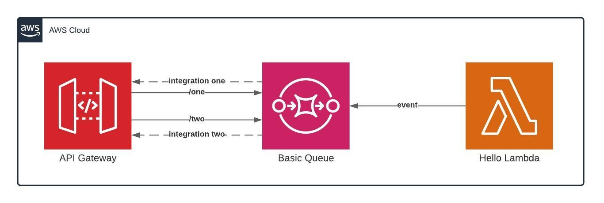

# apigtw-sqs-integration

This project is a basic sample of API gateway integration with an SQS queue.

## Architecture

Above have an architecture draw with the resources communications.



## Requirements
- Terraform v0.13.5
- Your aws credentials configured
- A s3 bucket for your tf.state file

## Applying your resources

First, make sure you have your credentials file configured with your AWS account in your local machine.

```editorconfig
[default]
aws_access_key_id = YOUR-ACCESS-KEY-ID
aws_secret_access_key = YOU-SECRET-ACCESS-KEY
```

Create a bucket in s3 and change your main.tf with your bucket name.

```terraform
terraform {
  backend "s3" {
    bucket = "my-bucket-name"
    key    = "tf-state/terraform.tfstate"
    region = "us-east-1"
  }
}
```

Initialize Terraform.

```bash
$ terraform init
```

Make a plan in the project root directory. *(optional)*

```bash
$ terraform plan
```

Do an apply to create all resources.

```bash
$ terraform apply
```

After applying the output show API gateway endpoints resources.

```bash
Outputs:

apigateway_resource_one = https://id.execute-api.us-east-1.amazonaws.com/dev/one
apigateway_resource_two = https://id.execute-api.us-east-1.amazonaws.com/dev/two
```

## Invoking API
To invoking your api gateway and test your infrastructure import the **collection** and **environment** from the **docs** folder and set your api gateway id generated from apply.

## Destroy

To destroy all your infrastructure just run terraform destroy.

```bash
$ terraform destroy
```

## Documentations

- https://registry.terraform.io/providers/hashicorp/aws/latest/docs
- https://docs.aws.amazon.com/lambda/latest/dg/with-sqs.html
- https://docs.aws.amazon.com/apigateway/latest/developerguide/api-gateway-method-request-validation.html
- https://docs.aws.amazon.com/apigateway/latest/developerguide/how-to-integration-settings.html
